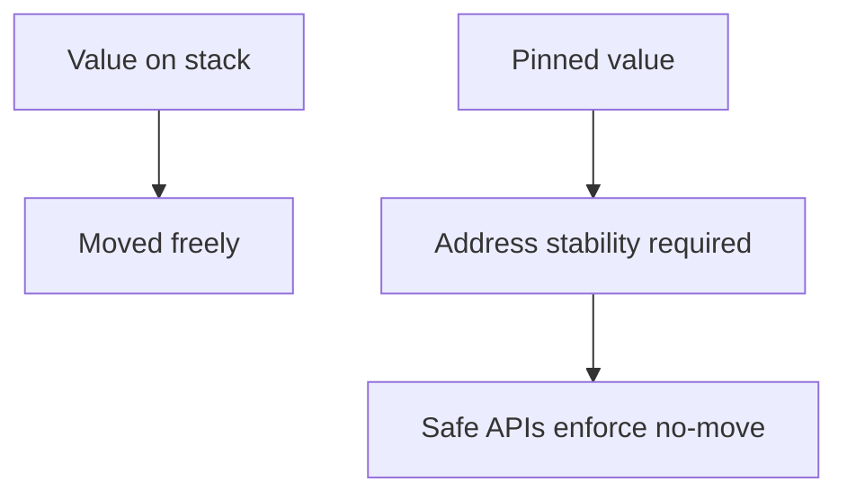

# Pin, Memory Stability, and Self-Referential Patterns

## Problem

Some async/state-machine patterns require values to remain at stable memory addresses.

## Core Concepts

- `Pin<T>`: prevents moving pinned data.
- `Unpin`: type can move safely after pinning.
- Most ordinary types are `Unpin`.

## Concept Diagram



## Practical Guidance

- Most application code does not need manual `Pin`.
- Learn it to understand async trait objects and custom futures.
- Avoid self-referential structs unless absolutely necessary.

## Example: Boxing a Future

```rust
use std::future::Future;
use std::pin::Pin;

type BoxFuture<T> = Pin<Box<dyn Future<Output = T> + Send>>;

fn immediate() -> BoxFuture<u32> {
    Box::pin(async { 42 })
}
```

## Safety Notes

If you touch `Pin` + `unsafe`, document invariants explicitly and test movement-related assumptions.

## Lab

1. Create API returning boxed future.
2. Compare generic future return vs boxed future ergonomics.
3. Document where dynamic dispatch tradeoff is acceptable.

## Review Questions

1. Why is stable address needed for some async internals?
2. When is `BoxFuture` useful despite overhead?
3. Why are self-referential structs hard to make safe?
