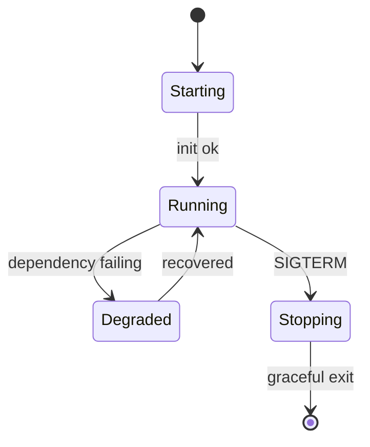

# Linux Integration and Service Management

## Objective

Run Rust systems software as reliable Linux services with safe deployment, restart, and observability behavior.

## Service Lifecycle Diagram



## Signal Handling Pattern

```rust
use tokio::signal;

#[tokio::main]
async fn main() {
    println!("service started");
    signal::ctrl_c().await.expect("signal handler");
    println!("received shutdown signal, draining");
}
```

## systemd Unit Template

```ini
[Unit]
Description=Rust Service
After=network.target

[Service]
ExecStart=/usr/local/bin/rust-service
Restart=on-failure
RestartSec=2
User=svcuser
Environment=RUST_LOG=info

[Install]
WantedBy=multi-user.target
```

## Operational Checklist

- startup dependency checks
- health endpoints for readiness/liveness
- structured logs to journald/stdout
- graceful shutdown timeout budget

## Lab

1. Package your binary under `/usr/local/bin`.
2. Create a unit file and enable auto-restart.
3. Simulate failure and verify restart + logs.

## Review Questions

1. Why use `Restart=on-failure` instead of always?
2. What should happen during SIGTERM handling?
3. Which health signal should gate load balancer routing?
