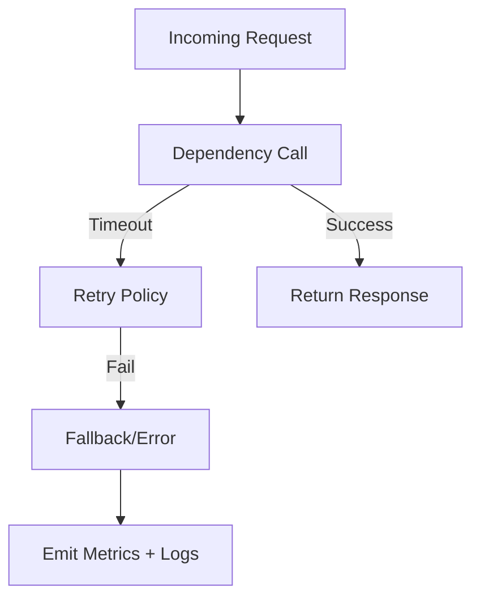

# Systems Testing and Failure Injection

## Why Failure Injection

Reliability claims are weak until tested under realistic faults.

## Failure Injection Matrix

| Scenario | Expected Behavior | Telemetry |
|---|---|---|
| Disk full | Request rejected safely | error logs + counter |
| Dependency timeout | Retry/backoff path | timeout metric |
| SIGTERM during load | graceful drain | shutdown duration |

## Failure Path Diagram



## Example: Controlled Timeout Wrapper

```rust
use tokio::time::{timeout, Duration};

async fn call_with_budget<F, T>(fut: F) -> Result<T, &'static str>
where
    F: std::future::Future<Output = T>,
{
    timeout(Duration::from_millis(150), fut)
        .await
        .map_err(|_| "dependency_timeout")
}
```

## Lab

1. Inject artificial delay into dependency adapter.
2. Verify timeout and retry telemetry.
3. Record recovery time objective (RTO).

## Review Questions

1. Why must failure tests be automated?
2. What metrics prove graceful degradation?
3. What is the risk of retrying all errors blindly?
