# Load Testing and Chaos Lab

## Goal

Measure network service behavior under stress and controlled faults.

## Test Plan

1. baseline throughput/latency at low load
2. ramp to saturation
3. inject dependency failures
4. observe recovery and error budget impact

## Load + Chaos Timeline

```mermaid
gantt
    dateFormat  X
    axisFormat %s
    title Load and Chaos Sequence
    section Load
    Warmup           :0, 20
    Ramp             :20, 40
    Steady State     :60, 40
    section Chaos
    Inject timeouts  :70, 10
    Recover          :80, 20
```

## Metrics to Capture

- requests/sec
- p50/p95/p99 latency
- error rate by category
- saturation indicators (queue depth, in-flight)

## Lab Deliverable

- performance report with charts
- incident notes from chaos window
- top 3 engineering actions for next iteration
