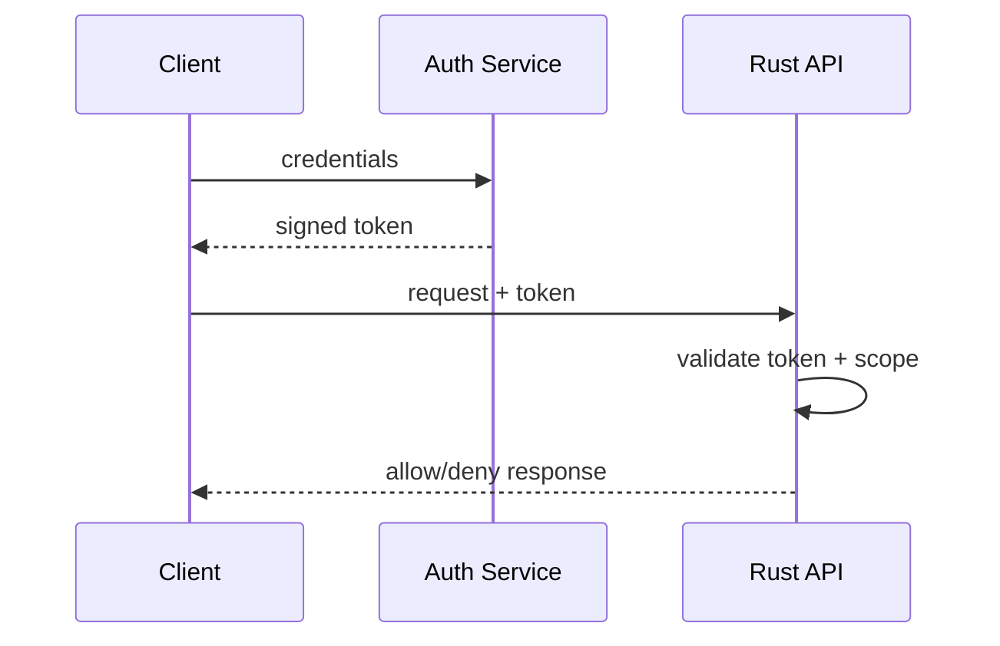

# Authentication and Authorization in Rust Services

## Core Concepts

- Authentication: who are you?
- Authorization: what are you allowed to do?

## Auth Flow Diagram



## Scope Check Example

```rust
fn has_scope(scopes: &[&str], required: &str) -> bool {
    scopes.iter().any(|s| *s == required)
}
```

## Authorization Policy Tips

- default deny
- least privilege
- explicit scope/resource mapping
- audit access decisions for sensitive paths

## Lab

1. Add role/scope middleware to one endpoint group.
2. Add tests for allow/deny policy cases.
3. Add audit log for privileged operations.
