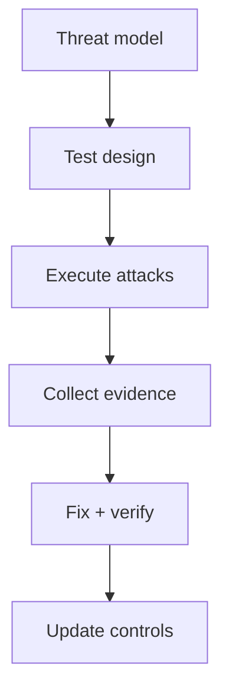

# Security Testing and Red Team Lab

## Objective

Validate your Rust service against common attack paths and demonstrate concrete mitigation evidence.

## Test Matrix

| Attack | Simulation | Expected Defense |
|---|---|---|
| Brute force | repeated auth attempts | rate limit + lockout |
| Injection payload | malformed input fields | strict validation |
| Token replay | reused token | nonce/expiry checks |
| Dependency vuln | known CVE crate | CI audit failure |

## Security Test Workflow

## Lab Deliverables

- security test report with severity ranking
- proof of fixes for top findings
- residual risk register
