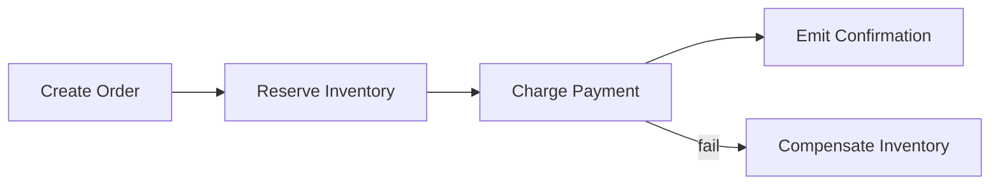

# Consistency and Data Patterns

## Consistency Models in Practice

- Strong: read-your-write guaranteed, higher coordination.
- Eventual: better availability, reconciliation required.
- Session-based: balanced user-centric guarantees.

## Saga Pattern Overview



## Idempotent Command Example

```rust
use std::collections::HashSet;

fn execute(cmd_id: &str, seen: &mut HashSet<String>) -> &'static str {
    if !seen.insert(cmd_id.to_string()) {
        return "duplicate_ignored";
    }
    "applied"
}
```

## Lab

1. Design one saga with compensation steps.
2. Add idempotency keys to command handler.
3. Write tests for retry-induced duplicates.
