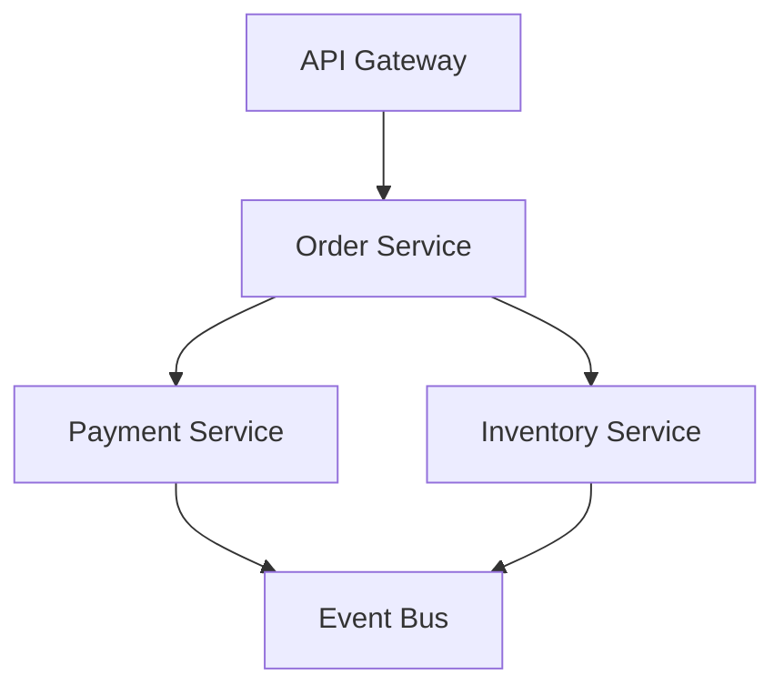

# Distributed Observability Lab

## Goal

Trace one business transaction across multiple services and prove incident diagnosis speed improves.

## Trace Topology Diagram

## Lab Steps

1. propagate trace context across service calls.
2. add consistent span naming conventions.
3. correlate logs with trace IDs.
4. trigger a partial failure and debug from telemetry.

## Success Criteria

- root cause identified within target MTTR window
- dependency latency contribution visible per span
- alert links directly to relevant dashboard/trace view
