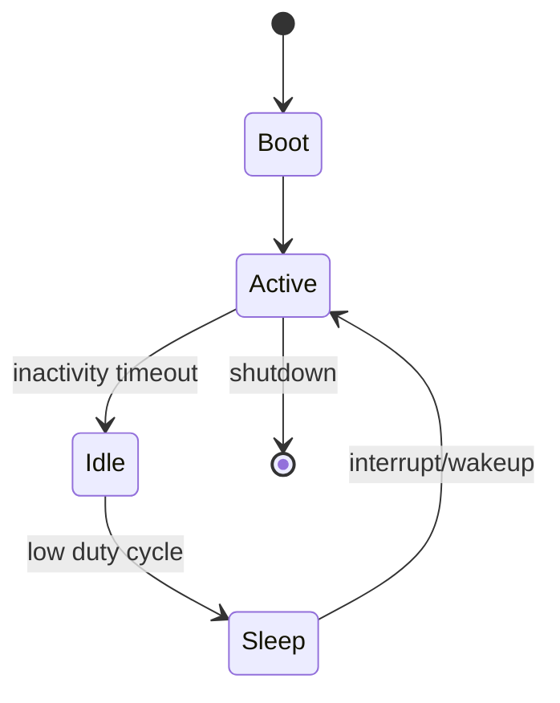

# Power Management and Reliability

## Why Power Is a First-Class Constraint

In edge devices, battery life and thermal budgets directly shape architecture decisions.

## Power-State Diagram



## Design Principles

- minimize wakeups
- batch sensor reads
- avoid unnecessary peripheral activation
- prefer deterministic schedules

## Example: Duty-Cycle Loop (Conceptual)

```rust
fn run_cycle() {
    sample_sensor();
    process_data();
    transmit_if_needed();
    enter_low_power_mode();
}

fn sample_sensor() {}
fn process_data() {}
fn transmit_if_needed() {}
fn enter_low_power_mode() {}
```

## Reliability + Power Tradeoff

Aggressive sleeping can delay fault detection. Define explicit safety-critical wake intervals.

## Lab

1. Create energy budget table for your firmware loop.
2. Measure impact of two duty-cycle configurations.
3. Validate wake-up behavior under interrupt storms.
