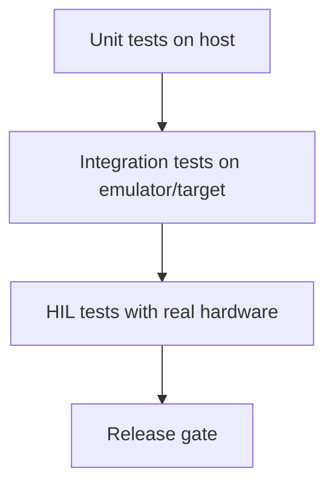

# Embedded Testing and Hardware-in-the-Loop

## Testing Layers

- host-level unit tests
- target-level integration tests
- hardware-in-the-loop (HIL) validation

## Test Layer Diagram



## Interface Mocking Example

```rust
trait TempSensor {
    fn read_celsius(&mut self) -> i16;
}

struct FakeSensor(i16);
impl TempSensor for FakeSensor {
    fn read_celsius(&mut self) -> i16 {
        self.0
    }
}
```

## HIL Checklist

- repeatable hardware setup
- explicit firmware and test versions
- captured serial logs/artifacts
- pass/fail thresholds documented

## Lab

1. Build fake peripheral tests on host.
2. Run one integration suite on actual board.
3. Compare observed timing against design budget.
