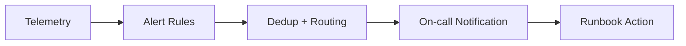

# Alert Engineering and On-Call Design

## Objective

Create actionable alerts that reduce MTTR without overwhelming responders.

## Alert Pipeline Diagram

## Alert Design Rules

- alert on user impact signals
- include clear action hint
- route by service ownership
- avoid duplicate pages from same root cause

## Example Burn-Rate Policy (Conceptual)

- fast burn alert: short window, high urgency
- slow burn alert: long window, planning urgency

## On-Call Readiness Checklist

- escalation chain defined
- runbooks linked in alerts
- dashboard links included
- post-incident review required

## Lab

1. Define two alerts for one SLO.
2. Simulate incident and verify route/escalation.
3. Tune thresholds to reduce false positives.
