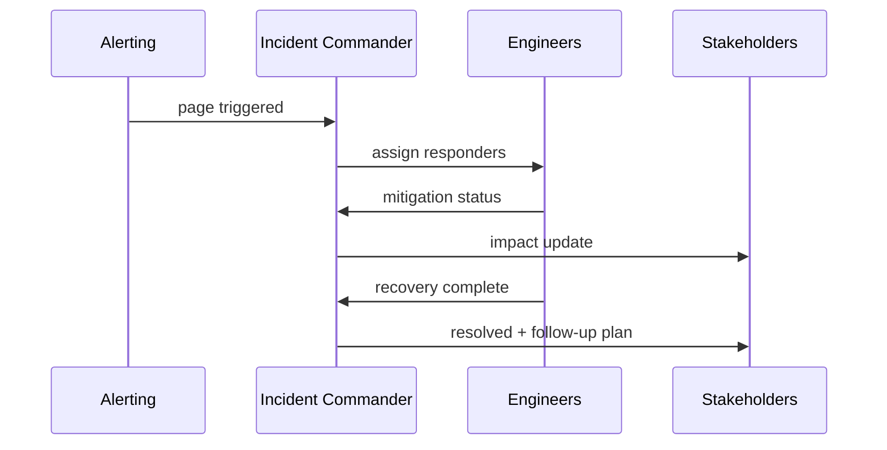

# Incident Command and Postmortems

## Incident Roles

- Incident Commander
- Communications Lead
- Operations Driver
- Subject Matter Experts

## Incident Timeline Diagram

## Postmortem Template

1. Summary and impact
2. Detection and response timeline
3. Root cause analysis
4. Corrective and preventive actions
5. Ownership and due dates

## Lab

1. Run tabletop incident drill.
2. Produce a blameless postmortem document.
3. Track action items to closure in backlog.
