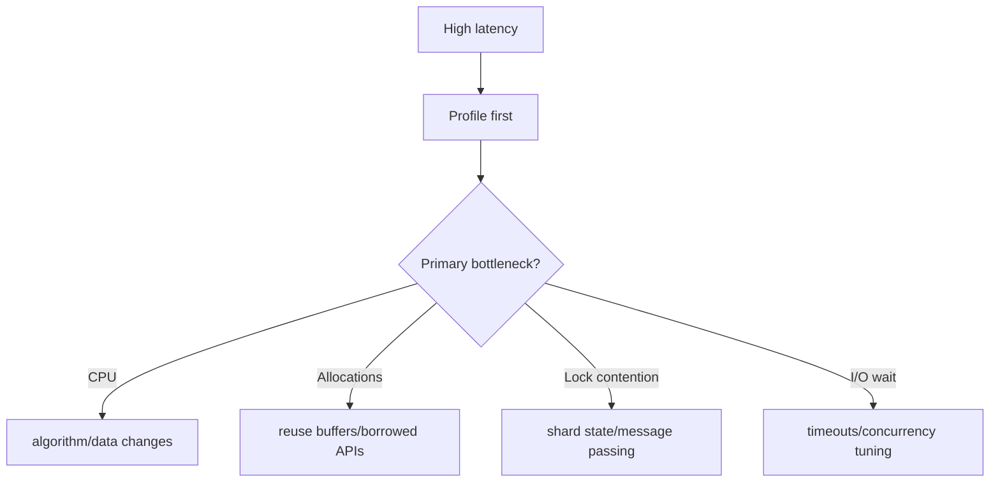

# Performance Anti-Patterns and Refactoring Tactics

## Common Anti-Patterns

- premature micro-optimizations without measurement
- repeated allocations in hot loops
- hidden blocking in async paths
- oversized critical sections around shared locks

## Anti-Pattern Remediation Map



## Example: Avoid Repeated Allocation

```rust
fn bad(lines: &[String]) -> usize {
    lines.iter().map(|s| s.to_string()).collect::<Vec<_>>().len()
}

fn good(lines: &[String]) -> usize {
    lines.iter().count()
}
```

## Lab

1. Identify one anti-pattern in your project.
2. Benchmark before and after refactor.
3. Document tradeoffs in code review notes.
