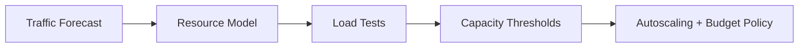

# Capacity Planning and Cost-Aware Performance

## Why Capacity Planning Matters

Performance without cost context can over-optimize the wrong bottleneck.

## Capacity Model Diagram

## Inputs for Planning

- expected requests/sec by time period
- CPU/memory footprint per request class
- latency SLO targets
- infrastructure budget constraints

## Example Planning Table

| Load Tier | Target RPS | CPU/Instance | Instances |
|---|---:|---:|---:|
| Normal | 500 | 45% | 4 |
| Peak | 1200 | 70% | 8 |
| Surge | 2000 | 80% | 14 |

## Lab

1. Build load tiers and target budgets.
2. Validate with synthetic and replay traffic.
3. Define autoscaling trigger + guardrails.
