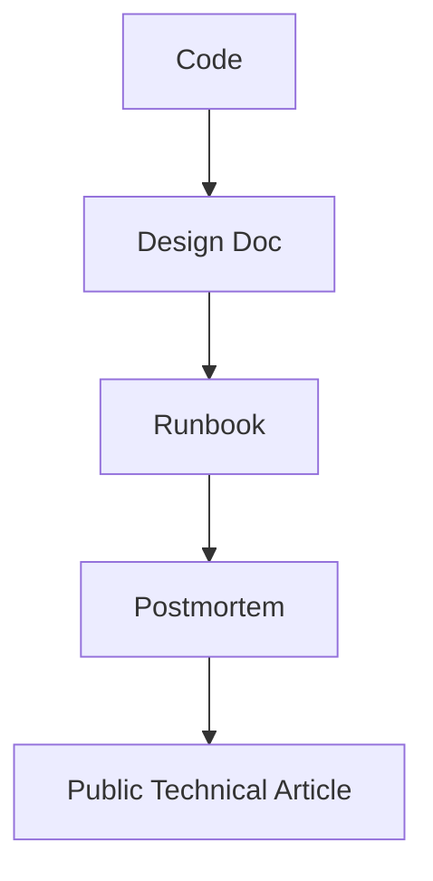

# Technical Writing and Teaching Your Work

## Why This Matters

Senior Rust engineers communicate architecture and tradeoffs clearly. Writing and teaching make your expertise visible.

## Communication Artifact Map

## Required Artifacts for Each Major Project

- architecture decision record (ADR)
- onboarding README
- operator runbook
- troubleshooting FAQ

## Blog Post Structure

1. Problem and constraints
2. Initial architecture
3. Failures and lessons
4. Final approach with metrics
5. Reusable patterns for others

## Lab

1. Write one deep technical article from your capstone.
2. Create one internal teaching session outline.
3. Add architecture diagram and benchmark table.
