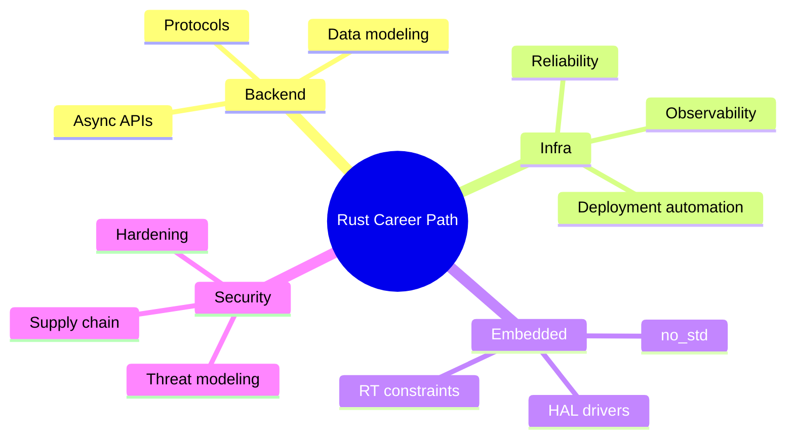

# Open Source and Specialization Roadmap

## Objective

Turn your book projects into long-term Rust expertise through focused open-source and domain specialization work.

## Specialization Tree

## 6-Month Contribution Plan

- Month 1-2: docs/tests contributions to target crate
- Month 3-4: bug fixes and performance issues
- Month 5-6: feature proposals and maintenance participation

## Portfolio Milestones

- 3 production-style Rust projects
- 2 incident/performance case studies
- 5 merged OSS pull requests in relevant domain

## Lab

1. Pick one target crate and submit first issue/PR.
2. Publish roadmap with measurable checkpoints.
3. Review progress monthly and adjust scope.
